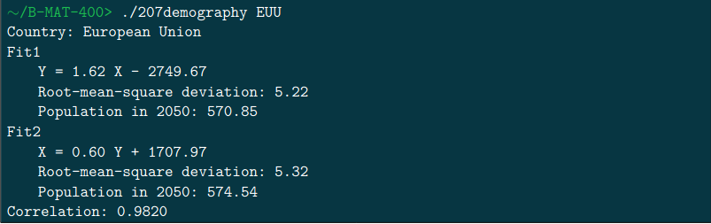
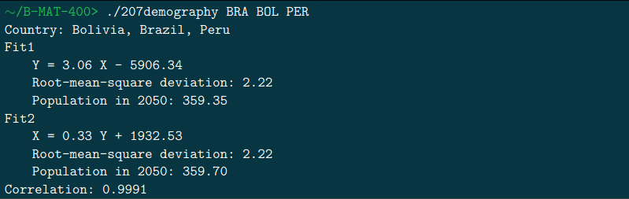

# 206neutrinos

The world population growth is a cause for concern for most people: 1 billion people in 1800, 2 billion people in 1927, 6 billion people in 2000 and more than 7.5 billion people today. . .

Predicting future population
using past censuses is therefore a key concept.
Along with this subject, you will find a file named **207demography_data.csv**, which gives an estimation of
every country’s population from 1960 onwards. If world population growth seems exponential in the longterm, in a shorter term it seems linear: using this data, you must establish the linear least squares regression
that will allow you to predict population depending on the year.

In the following, Yis the population (in million people) and Xthe year. With one or several country codes
as inputs, your program will print:

1. the aXand bXcoefficients of the linear fit Y= axX+ bx,

2. the root-mean-square deviation of this fit,

3. the population prediction in 2050 according to this fit,

4. the aY and bY coefficients of the linear fit X= ayY+ by,

5. the root-mean-square deviation of this fit,

6. the population prediction in 2050, according to this fit,

7. the correlation coefficient between Xand Y.

## Compile

The project compile with *Makefile*:

For compile the project use the commande:

```console
foo@bar:~/206neutrinos$ make re
```

For clean the project use:

```console
foo@bar:~/206neutrinos$ make fclean
```

Get instruction with:


```console
foo@bar:~/206neutrinos$ ./206neutrinos -h
```

## Example


